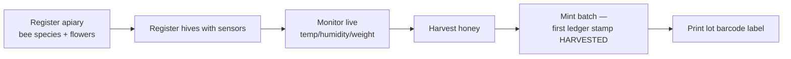
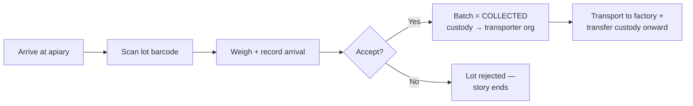
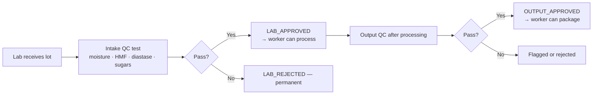
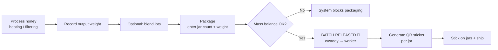
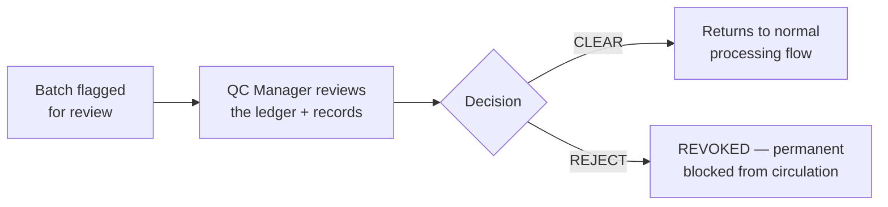
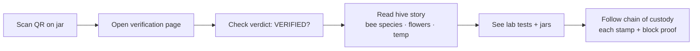
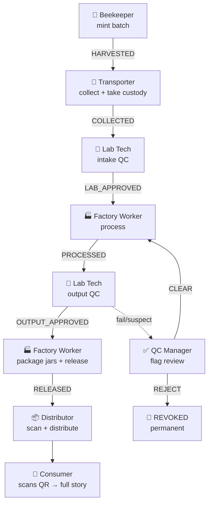
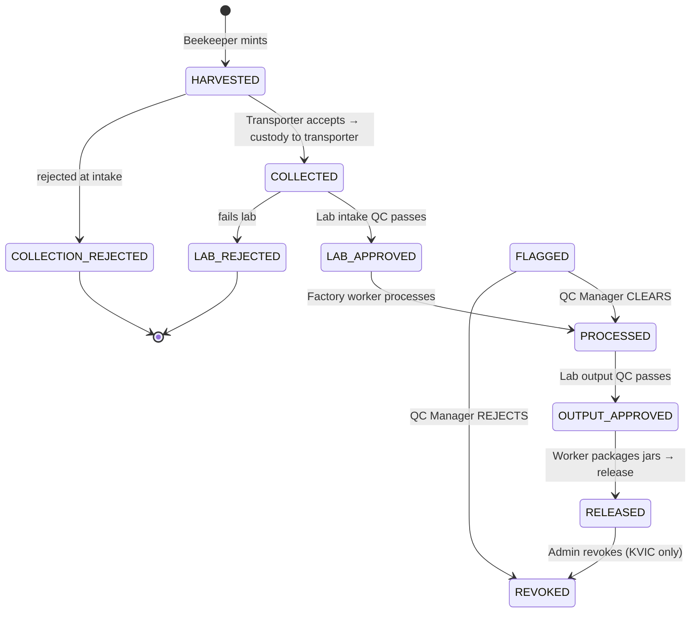

# HoneyChain 🍯

> From hive to home — every jar tells its true story.
> HoneyChain records each jar of honey's journey on a blockchain that no single company controls, and gives every jar a **QR sticker** you can scan to see where it really came from.

## What is HoneyChain?

Honey in India is often labelled "pure," "organic," or "single-source" — but none of that can be checked. Supply chains have many hands: a beekeeper, a transporter, a lab, a factory, a distributor. At every step someone *could* alter the records, and usually no one's watching.

HoneyChain fixes that with a simple idea:

> **The story of your honey is written once, signed by many, and can't be edited afterwards.**

Each step of the journey is recorded as a "sealed stamp" on a shared, tamper-evident ledger. The stamps are then combined into a **QR sticker** on the jar. Scan it, and the full story — from the exact hive and its temperature, to the lab tests and the jar filling — opens on your phone.

## The problem

- ❓ **You can't verify claims.** "Pure honey" is a label, not a fact.
- 👥 **Too many hands.** Beekeeper → transporter → lab → factory → distributor, each a separate organisation with its own records.
- 🔁 **Records can be rewritten.** A normal database lets anyone quietly edit history.
- 📷 **No proof at the point of sale.** The jar you hold has no connection to how it was made.

## The solution

- 🏛️ **Shared, permissioned ledger** (Hyperledger Fabric) — every organisation runs their own copy; records are signed by *multiple* organisations, so history can't be silently rewritten.
- 🔐 **Hash-anchoring** — sensitive details (locations, recipes, measurements) stay private in the project's database, while their cryptographic "fingerprints" are sealed on-chain.
- 🏷️ **QR stickers on every jar** — scan to see the full hive-to-home history + an authenticity verdict.
- 🛡️ **Built-in anti-fraud** — mass-balance checks and drift detection that automatically flag suspicious batches.

---

## The people — who does what

HoneyChain is used by **8 types of people**. Each one has a specific job, a specific app screen, and a specific stamp they add to the ledger.

### 🐝 1. The Beekeeper
*The person who keeps the hives and harvests the honey.*

**What they do:**
- Set up their profile: name of the apiary (bee farm), location, **bee species** (e.g., Indian hive bee), and **floral source** (what flowers the bees visit — e.g., sunflower, neem).
- Register each hive with its sensor device.
- Watch live hive health: **temperature inside/outside, humidity, weight**, and AI-powered health alerts.
- When honey is harvested, **mint a new batch** — the beginning of the ledger story.
- Print a **barcode label** for the raw honey boxes.

**Behind the scenes:** minting writes the batch's first on-chain record (`HARVESTED`) using fingerprints of the hive, beekeeper, and harvest data.



```
  1. Register apiary (bee species + flowers)
  2. Register hives with sensors
  3. Monitor live temp / humidity / weight
  4. Harvest honey
  5. Mint batch  ──▶  first ledger stamp: HARVESTED
  6. Print lot barcode label
```

### 🚚 2. The Transporter
*Collects raw honey from the apiary and brings it to the factory.*

**What they do:**
- Scan the lot barcode at the apiary.
- Record collection: weight of honey received and whether it's accepted.
- **Custody moves to the Transporter's organisation on-chain** the moment they accept — the ledger knows exactly who is responsible for the honey.
- Transport it to the factory, and transfer custody onward when required.

**Behind the scenes:** `RecordCollection` moves the batch to `COLLECTED` and assigns custody to the transporter's organisation automatically.



```
  1. Arrive at apiary
  2. Scan lot barcode
  3. Weigh + record arrival
  4. Accept? ── Yes ──▶  batch = COLLECTED, custody → transporter org
             └─ No ────▶  lot rejected (story ends)
  5. Transport to factory + transfer custody onward
```

### 🧪 3. The Lab Technician
*Tests the honey at the factory's lab.*

**What they do:**
- **Intake QC:** run the first quality test on the raw honey — moisture, HMF (freshness), diastase (enzyme activity), sugar profile, isotope ratio.
- Approve → batch becomes `LAB_APPROVED` (ready for processing).
- **Output QC:** after processing, test the finished output. This is the "QC approve" step.
- Reject if the honey fails.

**Behind the scenes:** every test result is fingerprinted and sealed on-chain (`RecordLabResult`). Rejections are permanent — a rejected batch can never continue.



```
  1. Lab receives lot
  2. Intake QC test (moisture · HMF · diastase · sugars)
  3. Pass? ─── Yes ──▶  LAB_APPROVED  → worker can process
            └─ No  ──▶  LAB_REJECTED  (permanent)
  4. Output QC after processing
  5. Pass? ─── Yes ──▶  OUTPUT_APPROVED → worker can package
            └─ No  ──▶  flagged or rejected
```

### 🏭 4. The Factory Worker
*Processes the honey and turns it into jars.*

**What they do:**
- **Process:** log each unit operation (heating, filtering) with the weight going in and out (mass balance).
- **Blend:** optionally combine source lots into a single blend batch.
- **Package:** enter the number of jars + average net weight. The system checks this against the processed weight (±2%).
- **Make jars:** on success, the batch is **released**, every jar gets an ID + verification link, and **QR stickers are generated.**
- Print/share the QR stickers to stick on the jars.

**Behind the scenes:** `RecordPackaging` moves the batch straight to **`RELEASED`** and hands custody to the worker's organisation. No final lab re-check is needed — packaging *is* the release.



```
  1. Process honey (heating / filtering)
  2. Record output weight
  3. Optional: blend lots
  4. Package — enter jar count + net weight
  5. Mass balance OK?
       No  ─▶ system blocks packaging
       Yes ─▶ BATCH RELEASED 🎉  custody → worker
  6. Generate QR sticker per jar
  7. Stick on jars + ship
```

### ✅ 5. The QC Manager
*KVIC's quality reviewer — the neutral referee.*

**What they do:**
- Review batches that have been **flagged** (possible fraud, drift, or integrity concern).
- **CLEAR** → the batch returns to processing.
- **REJECT** → the batch is permanently **revoked** from circulation.

**Behind the scenes:** only the KVIC organisation can resolve flags (`ResolveFlag`). A revoked batch can never be released again.



```
  1. Batch is flagged for review
  2. QC Manager reviews the ledger + records
  3. Decision:
       CLEAR  ─▶ returns to normal processing flow
       REJECT ─▶ REVOKED (permanent — blocked from circulation)
```

### 📦 6. The Distributor
*Takes the released jars to shops and customers.*

**What they do:**
- Scan released batches/jars to confirm they are authentic and not revoked.
- Distribute them to retail / customers.

**Behind the scenes:** the scan checks the live ledger state; revoked or flagged jars can't be silently handed on.

```
  1. Scan released batches / jars
  2. Confirm authentic + not revoked
  3. Distribute to retail / customers
```

### 🛡️ 7. The Admin (KVIC)
*The government commission that operates HoneyChain.*

**What they do:**
- Register and manage organisations and users.
- See a **dashboard** of everything happening across the network.
- Explore **on-chain proof** for any transaction (block, transaction id, payload hash, actor).
- Verify a transaction's proof against the ledger.
- Watch Fabric network health.

**Behind the scenes:** admins get full read access to the indexed ledger events; every transaction's proof (who signed, what hash, which block) is visible.

```
  1. Register + manage organisations and users
  2. Dashboard — everything happening across the network
  3. Explore on-chain proof: block · tx id · payload hash · actor
  4. Verify any transaction's proof against the ledger
  5. Watch Fabric network health
```

### 🙋 8. The Consumer
*You, with the QR sticker.*

**What they do:**
- **Scan the QR** on the jar (or visit the link printed on the sticker).
- See the **authenticity verdict** — VERIFIED or a warning — plus:
  - The hive story: **bee species, floral source**, and live hive **temperature**.
  - Harvest details and batch weight.
  - **Quality test results** from the lab.
  - All the **jars** made in that batch.
  - The **chain of custody** — every stamp, who did it, when, which block.

**Behind the scenes:** the page combines the private database (details) with the live ledger (verification) — the jar is "VERIFIED" only when both agree.



```
  1. Scan QR on jar ──▶ open verification page
  2. Check verdict: is it VERIFIED?
  3. Read the hive story (bee species · flowers · live temperature)
  4. See lab tests + every jar in the batch
  5. Follow the chain of custody (each stamp + block proof)
```

---

## The journey of the honey — one big picture



**ASCII version (renders anywhere):**

```
 🐝 Beekeeper        🚚 Transporter       🧪 Lab Tech         🏭 Factory Worker
 ─────────────       ───────────────      ───────────         ────────────────
 mint batch ──────▶  collect + take   ──▶ intake QC      ───▶ process
 HARVESTED          custody            → LAB_APPROVED       → PROCESSED
                     → COLLECTED

 🧪 Lab Tech          🏭 Factory Worker   📦 Distributor      🙋 Consumer
 ──────────          ───────────────     ──────────────      ───────────
 output QC     ───▶ package jars +   ──▶ scan + distribute ─▶ scan QR sticker
 → OUTPUT_APPROVED  release → RELEASED   → shops              → full story page

                  ↕ flag review (✅ QC Manager)
                  CLEAR → back to processing
                  REJECT → 🚫 REVOKED (permanent)
```

---

## Under the hood — for the curious

### How the pieces fit together

```
 Beekeeper App ──┐                          ┌── Consumer Portal (Next.js)
 Factory App ────┤   Core API (Express)     ├── KVIC Dashboard (Next.js)
                 ├────►  auth · batches ·   │
                 │     factory · verify     │
                 │     hives · admin · QR    │
                 ▼              │            ▼
   PostgreSQL               Fabric Gateway ──► Hyperledger Fabric
   (people, hives,           SDK               (3 peer orgs + orderer)
    quality, jars,           submit/evaluate   └─ Go chaincode "honeychain"
    sensor telemetry)             │              └─ Hash-only world state
                                 Redis (caches verify pages)
```

### Where the data lives (the smart bit)

| Private PostgreSQL (off-chain) | Public ledger (on-chain) |
|---|---|
| Live hive temperature, humidity, weight | `HiveHash` (fingerprint) |
| Bee species, floral source, apiary | `BeekeeperHash` |
| Quality measurements, processing params | `HarvestHash` · `CollectionHash` · `LabCertificateHash` |
| Jar serial numbers, weight records | `PackagingHash` · `BottleSummaryHash` |
| Full custody history for display | `CustodyEvent` + `ChainEventRecord` (block-sealed) |

On-chain we store only **SHA-256 fingerprints**. No hive locations or recipes in the shared ledger. To fake a jar's history you'd have to break the crypto **and** get multiple organisations to sign it.

### Official state machine of a batch



### Who is allowed to do what

| Stamp (chaincode call) | Performed by | Org |
|---|---|---|
| Mint batch | Beekeeper | Org 1 (KVIC) |
| Collect + custody | Transporter / Factory Worker | Org 2 (Factory) |
| Lab test approve/reject | Lab Technician | Org 3 (Lab) |
| Process / blend | Factory Worker | Org 2 |
| Package + release | Factory Worker | Org 2 |
| Transfer custody | Beekeeper / Transporter / Factory Worker | custodian org |
| Resolve flag | QC Manager / Admin | Org 1 (KVIC) |
| Revoke | Admin | Org 1 (KVIC) |

Every call is **double-checked**: the signing organisation must belong to the right org **and** carry the right role attribute.

### Anti-fraud, built in

- ⚖️ **Mass balance** — jars × weight must match the processed output within 2%, or packaging is blocked.
- 📉 **Drift detection** — the output QC is compared to the intake panel; suspicious drift **auto-flags** the batch.
- ✍️ **Custody rules** — only the current custodian org can pass the lot on.
- 🗂️ **Proof for every transaction** — block, transaction id, actor MSP, and payload hash are all recorded and auditable.

---

## Tech stack

| Layer | Tech |
|---|---|
| Blockchain | Hyperledger Fabric (Raft, 3 peer orgs) |
| Chaincode | Go (`fabric-contract-api-go`) |
| Core API | Node.js 22 · Express · TypeScript |
| Database | PostgreSQL + TimescaleDB (sensor telemetry) |
| Cache | Redis |
| Beekeeper / Factory apps | Expo · React Native 0.81 |
| Consumer portal & KVIC dashboard | Next.js · React |
| Barcodes / QR | `bwip-js` |

## Project layout (high level)

```
chain/            Fabric network bootstrap + Go chaincode (honeychain)
services/backend/ Core API: auth, batches, factory, verify, hives, admin
apps/beekeeper-app/   Beekeeper app (Expo)
apps/factory-app/     All factory operator apps (Expo)
apps/consumer-web/    The QR verification portal
apps/kvic-dashboard/  KVIC dashboard + ledger proof explorer
docs/             Detailed architecture, build, and PRD documents
```

---

## What the team shipped this sprint

- ✅ **No final QC gate** — once Output QC approves, the worker packages the jars and **releases** the batch directly (no extra lab step).
- ✅ **Real QR stickers** — packaging now returns a working per-jar verification link + a rendered QR image.
- ✅ **Beautiful consumer portal** — scanning a QR opens a full hive-to-home story: bee species, floral source, live hive temperature, lab results, every jar, and the chain-of-custody timeline.